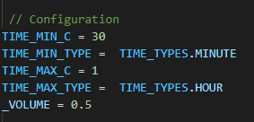

# Doot Doot Random Auto Player

This "project" is intended as a funny random little spook.
Within a defined random interval, the video will start and you will get spooked. It uses Greenscreen, so you can include it, whereever you want.

For example: You can include it into your OBS using "Browser Source".

## Configurations

You can set the "random interval" with the variables displayed in the picture:

### Constants

**TIME_MIN_C:**  *'number'* earliest time for playing the video

**TIME_MAX_C:**  *'number'* latest time for playing the video

**TIME_MIN_TYPE:** *'Constant' {HOUR,MINUTE,SECOND}* Defining which time type you are using for TIME_MIN_C.

**TIME_MAX_TYPE:** *'Constant' {HOUR,MINUTE,SECOND}* Defining which time type you are using for TIME_MAX_C.

**_VOLUME:** Adjusting the Volume (from 0.0 to 1.0) of the video

## Used Resources

Used this Video from Musical Ghost:
[https://www.youtube.com/watch?v=St7X_TcGiS8](https://www.youtube.com/watch?v=St7X_TcGiS8)
